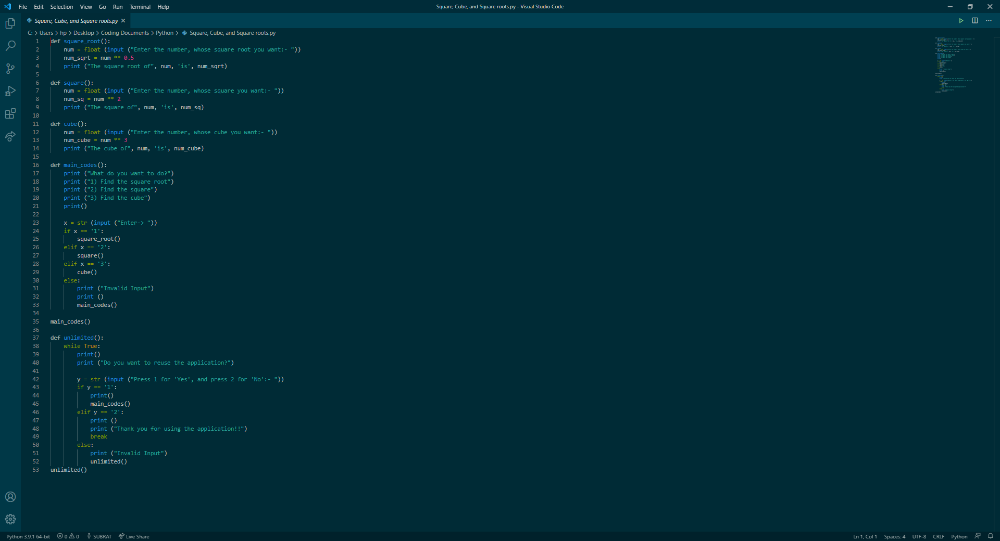

# Squares Cubes and Square Roots
Dear all, This is a simple Python Document in which, we can find the squares, cubes, and Square Roots of any number!
```
I prefer using Visual Studio Code for this purpose but Python IDLE can also be used!
```
You can just have a good idea of codes from the Visual Studio Code (or VSC) by this:
</img>
You will find the Python File in the files section, or get it here:
```
def square_root():
    num = float (input ("Enter the number, whose square root you want:- "))
    num_sqrt = num ** 0.5
    print ("The square root of", num, 'is', num_sqrt)

def square():
    num = float (input ("Enter the number, whose square you want:- "))
    num_sq = num ** 2
    print ("The square of", num, 'is', num_sq)

def cube():
    num = float (input ("Enter the number, whose cube you want:- "))
    num_cube = num ** 3
    print ("The cube of", num, 'is', num_cube)

def main_codes():
    print ("What do you want to do?")
    print ("1) Find the square root")
    print ("2) Find the square")
    print ("3) Find the cube")
    print()

    x = str (input ("Enter-> "))
    if x == '1':
        square_root()
    elif x == '2':
        square()
    elif x == '3':
        cube()
    else:
        print ("Invalid Input")
        print ()
        main_codes()

main_codes()

def unlimited():
    while True:
        print()
        print ("Do you want to reuse the application?")

        y = str (input ("Press 1 for 'Yes', and press 2 for 'No':- "))
        if y == '1':
            print()
            main_codes()
        elif y == '2':
            print ()
            print ("Thank you for using the application!!")
            break
        else:
            print ("Invalid Input")
            unlimited()
unlimited()
```

However, I prefer to see the files section as it would give you a good idea about the Python Codes as well! [Click here](https://github.com/Subrat2006/Squares-Cubes-and-Square-Roots/blob/main/Square%2C%20Cube%2C%20and%20Square%20roots.py) to go the .py file directly
